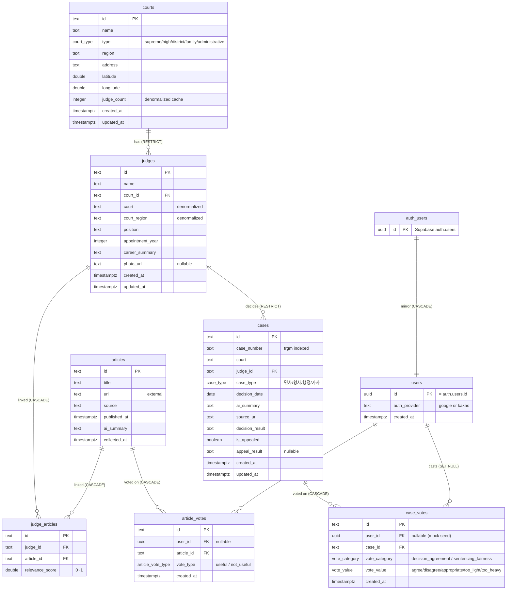
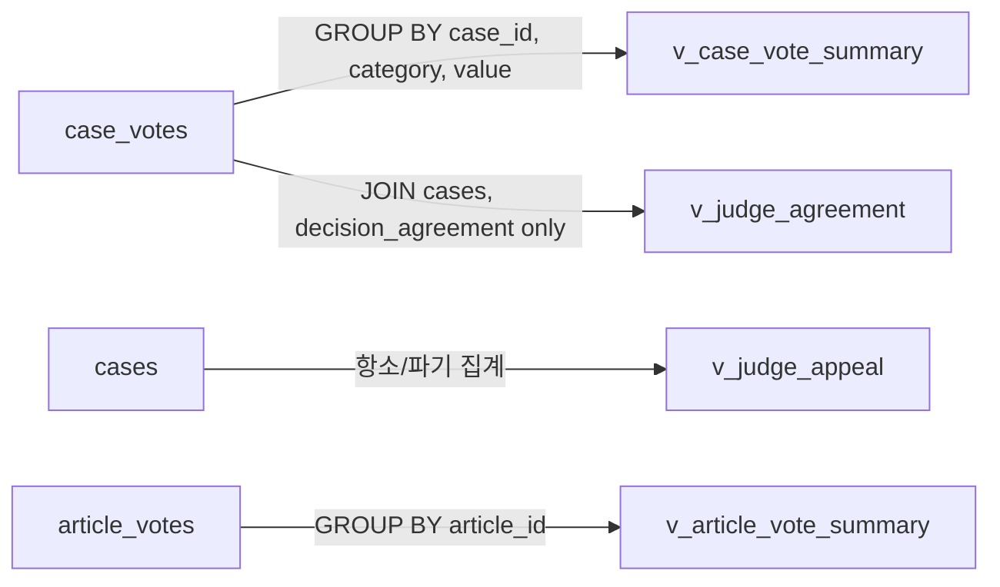
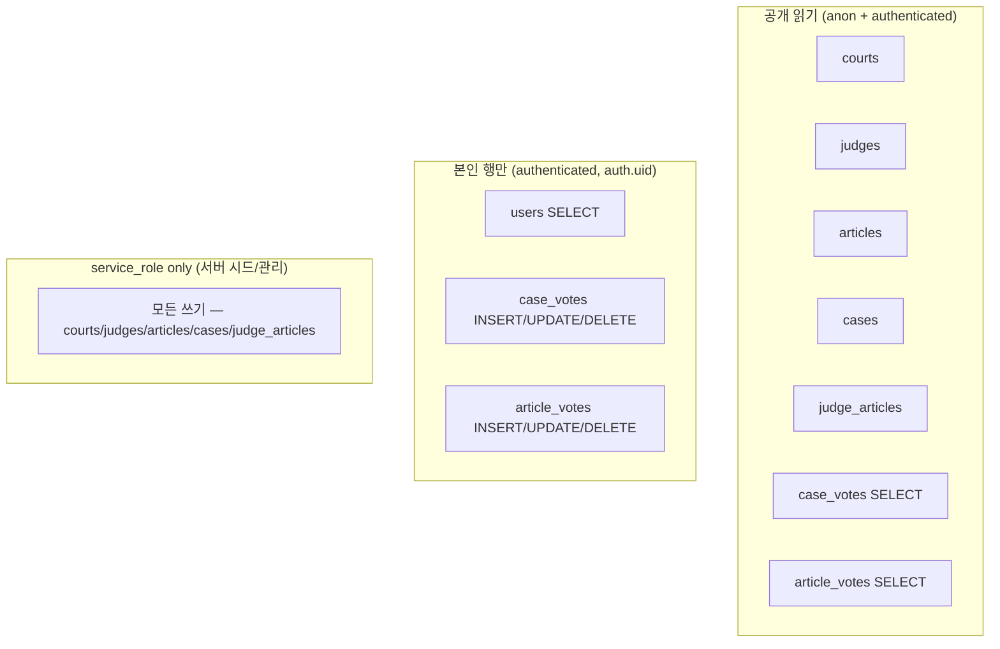
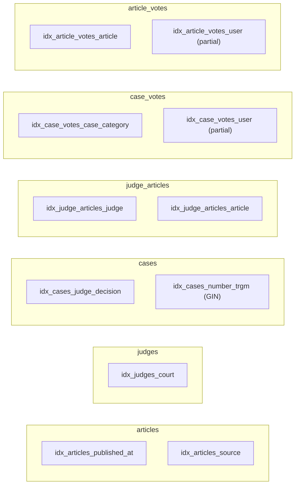

# PansaWatch — ERD

Phase 2 (Supabase Postgres) 진입 전 청사진. 8개 테이블 + 4개 view.

## 핵심 관계도 (Mermaid erDiagram)

## 무결성 / 제약 요약

| 테이블 | 핵심 제약 |
|-------|----------|
| `courts` | `CHECK (judge_count >= 0)` |
| `judges` | `CHECK (appointment_year BETWEEN 1900 AND 2100)`, FK courts RESTRICT |
| `cases` | `CHECK (is_appealed = true OR appeal_result IS NULL)`, FK judges RESTRICT |
| `judge_articles` | `UNIQUE(judge_id, article_id)`, `CHECK (relevance_score BETWEEN 0 AND 1)`, FK CASCADE |
| `case_votes` | category-value 정합 CHECK, `UNIQUE(user_id, case_id, vote_category)` (1인 1투표) |
| `article_votes` | `UNIQUE(user_id, article_id)` |
| `users` | FK auth.users CASCADE, `CHECK (auth_provider IN ('google','kakao'))` |

## 집계 view

| View | 역할 | 매핑 헬퍼 |
|------|------|----------|
| `v_case_vote_summary` | 판례 x 카테고리 x 값 카운트 | `getCaseVoteSummary` |
| `v_judge_agreement` | 판사별 시민 동의율 (투표 단위) | `getJudgeAgreementRate` |
| `v_judge_appeal` | 판사별 항소/파기 카운트 + 파기율 | `getJudgeAppealRate` (부분) |
| `v_article_vote_summary` | 기사별 useful/not_useful 카운트 | `getArticleVoteSummary` |

## RLS 정책 요약

## 인덱스 맵

